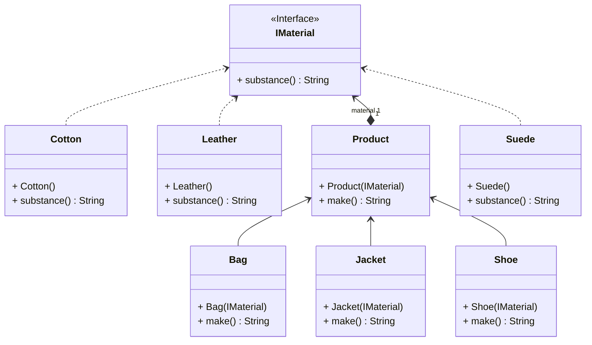

# Patron de conception "Pont"

## Illustré avec l'exemple d'une production de produits prêts à porter

### Pourquoi il existe
Le patron du pont existe pour solutionner des projets qui contiennent des objets de classes différentes partageant quelques propriétés et sous-classes en commun.
Plutôt que de créer une copie d'une sous-classe à une autre et d'y connecter à une superclasse par héritage, on peut se servir de la méthode de composition
Deux objets avec les même sous-classes ne peuvent pas partager la même hiérarchie par héritage puisque la connection est directe : de parents à enfants.
Grâce à l'implémentation de la composition (par classe d'abstraction ou par interface), un autre objet de classe différente peut avoir accès aux mêmes méthodes et paramètres qu'une autre classe du même niveau.

### Description du patron de conception
D'abord, on doit retrouver une classe d'Abstraction contenant un objet de l'interface Implémentation et des méthodes et des attributs appropriés.
Ceci devient donc une composition. Par la suite, l'interface Implémentation contient les méthodes et les attributs qui peuvent être appliqués sur les classes concrètes qui implémentent cet interface.
Si désiré, on peut aussi créer des classes Abstractions Fines ayant comme parent la classe Abstraction principale, pour ajouter des implémentations plus détaillées.

### Exemple dans une bibliothèque Java
Dans la librairie Java, on retrouve la JDBC (Java Database Connectivity) qui utilise le patron de conception du pont avec les interfaces du package java.sql comme la Connection et le Statement.
La classe qui les implémente est le DriverManager qui contient une liste de drivers spécifiques (com.mySql.cj.jdbc.Driver, org.postgresql.Driver, etc.) dans ses attributs pour créer une connection à une base de données SQL.
Lorsque la méthode getConnection est appliqué au DriverManager, le pont est créé avec l'url de la base de données, le nom de l'utilisateur et son mot de passe.
Lorsqu'on implémente l'interface de Statement, on peut y envoyer des requêtes SQL par le SGBD peut importe le type de base de données qui est choisi sans modifier le code et sa hiérarchie.
Par exemple, la base peut être changée de MySQL à PostgreSQL.

